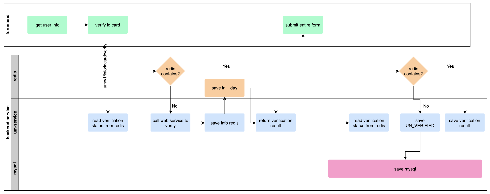

### Data structure

1. **DataBase**

   ```mssql
   ALTER table ls_um_user_info_t
   ADD COLUMN verification_status varchar(30) DEFAULT 'UN_VERIFIED' COMMENT 'id verification status'
   ```

2. **DTO**

   ```java
   class UserInfoDTO {
     private VerficationStatus verificationStatus;
   }
   
   enum VerficationStatus {
     UN_VERIFIED, CHINA_ID_VERIFIED
   }
   ```


### API definition

1. **ID card verify** (new api)

   **POST** um/v1/info/idcard/verify

   *Verify ID card and upload result to redis as cache*

   ``` javascript
   role acccess: worker
   
   request:
   String idCardNumber
   String name
   
   response:
   data(boolean): true/false  
   HTTP CODE:200  //verified, result is in data
   HTTP CODE:400	 //request failed, need to retry
   ```

   

2. **ID card verify and update**

   **POST** um/v1/info/idcard/verify-and-update

   *Verify ID card and update ID card if verification passed*

   ```javascript
   role acccess: worker
   
   request:
   String idCardNumber
   String name
   
   response:
   data(boolean): true/false  
   HTTP CODE:200  //verified, result is in data
   HTTP CODE:400	 //request failed, need to retry
   ```


3. **Check IP region**

   **GET** um/v1/info/ip-region

   Find the real region by user's ip address

   ```javascript
   role acccess: all roles
   
   request:
   nothing
   
   response:
   data(String): "中国","美国",...
   HTTP CODE:200  //checked, result in field : data
   HTTP CODE:400	 //check fails, need to retry
   ```

   

3. **ID card update** (already exists)

   **POST** um/v1/info/idcard/update

   *Check verification status if idCardType is CHINA_RESIDENT_IDENTITY_CARD, return failed response if verification status is VERIFIED*

   

3. **Retrieve user info** (already exists)

   **GET** um/v1/info/get

   **GET** um/v1/info/get/id

   *return verificationStatus*
   
   ```json
   response:
   {
      "verificationStatus": "UN_VERIFIED"
   }
   ```


### Process Flow

**Complete User Info**





### Note
1. **update id card**

check all endpoint of updating user info.

If updates relate to id card updating, verificationStatus needs to be checked, id card can not be updated in status: CHINA_ID_VERIFIED.

2. **avoid frequently web service call**

should cache id card verification result if we can, avoid calling web service repeatly, to save money.

the max times of users register is 600 per day now, in worest condition, there could be 1200+ times call for verification.

3. **Cache Penetration Or Malicious Request**

should avoid frequently request to verification id card, backend service must check the verification-failed times of every userId.

verification request is allowed up to 5 times per day for each user.
