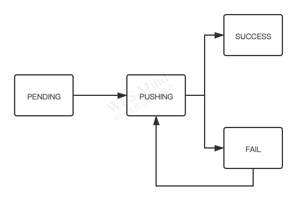
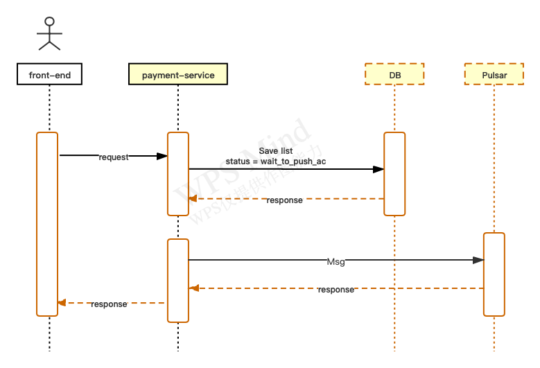
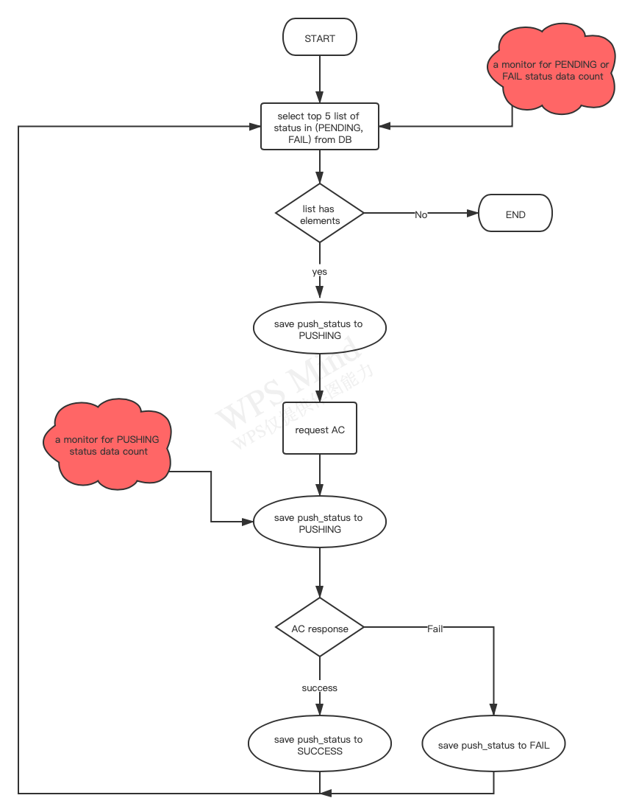

## **new field to save current push status**
Push_Status: PENDING, PUSHING, SUCCESS, FAIL

```SQL
ALTER TABLE ls_um_payment_ac_invoice_t ADD COLUMN push_status VARCHAR(20) DEFAULT 'PENDING' COMMENT 'push invoice to AC status';
```




## **backend process of pushing invoice**

1. **/invoice/push will just save an invoice list waiting to push**

    due to it's a simple process, api will response very quickly.



2. **set an always-running-thread to push invoice async**
    
    a. thread will stop and ack msg after there is no data to do,
    
    b. rely on Pulsar to ensure the thread can be restarted when it crashed

    c. only one thread will start due to Shared consume mode of Pulsar topic

    
    
3. **the way to confirm process thread alive**

    a. thread will log its status periodically

    b. check the ack status of pulsar topic msg 
